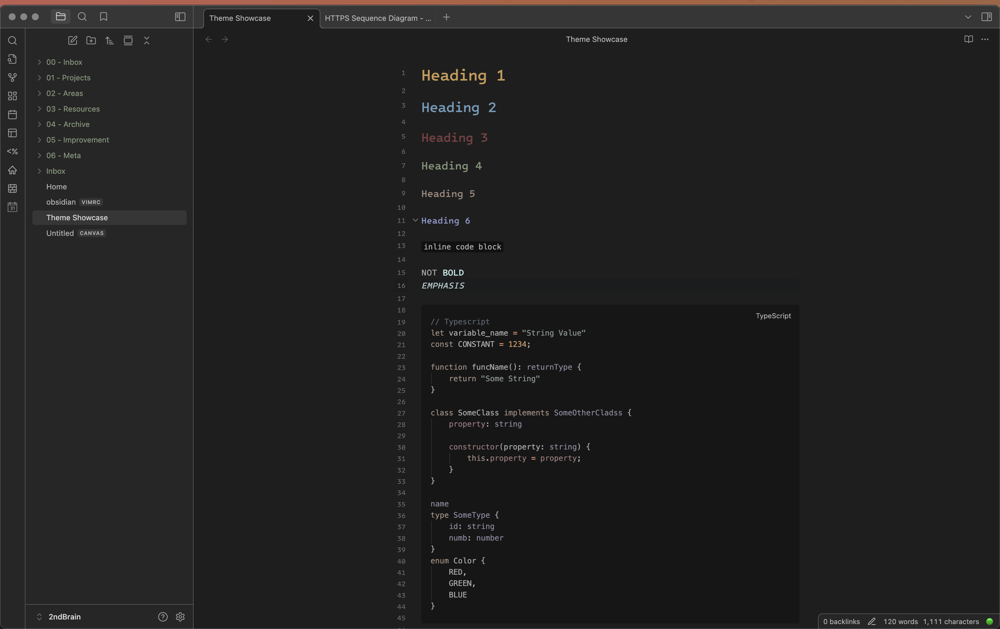
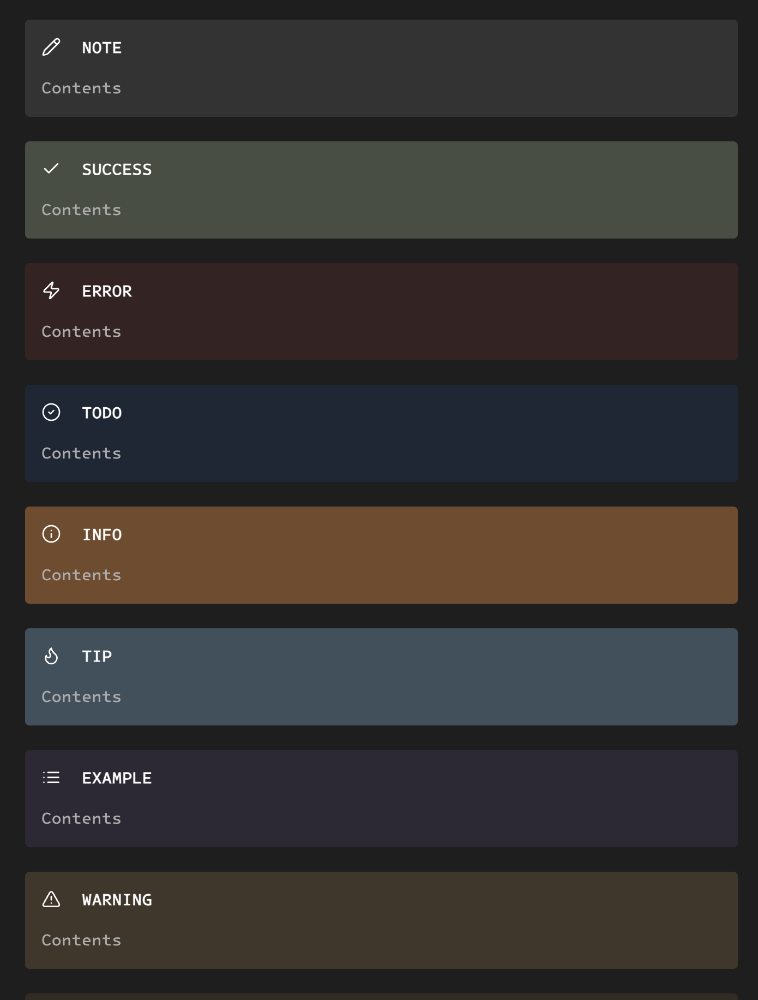
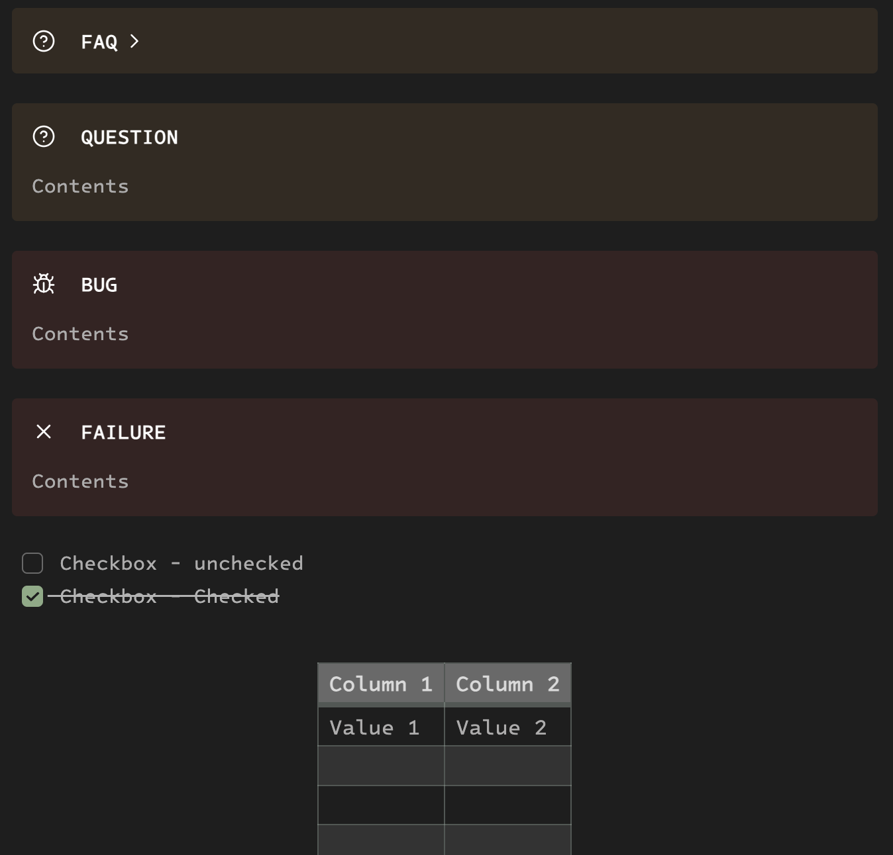

# Hojicha - Obisidian

This theme draws inspiration from the work of [neomodern](https://github.com/cdmill/neomodern.nvim).

>Hojicha is a Japanese green tea that's roasted over charcoal, giving it a unique, toasty flavor and a light golden color.

## Examples

