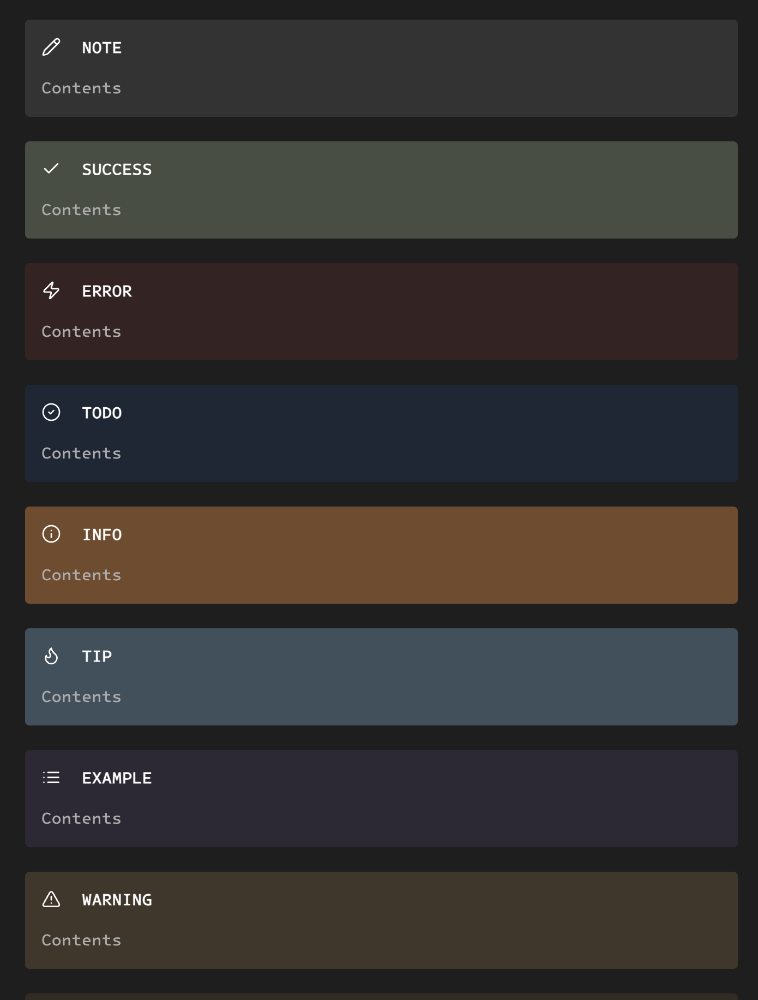
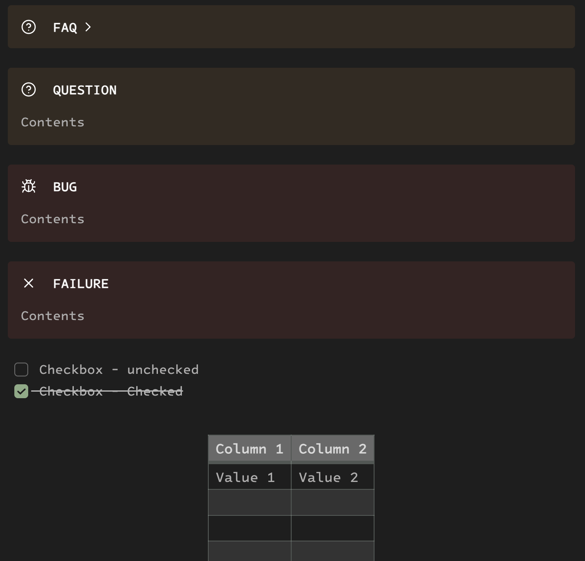

# Hojicha - Obsidian

>Hojicha is a Japanese green tea that's roasted over charcoal, giving it a unique, toasty flavor and a light golden color.

Immerse your mind in the warm, earthy tones of Hōjicha, a handcrafted Obsidian theme inspired by the roasted elegance of Japanese green tea. 

Like its namesake, this theme brings a delicate balance of simplicity and depth — perfect for focused thinking and mindful writing.

•	🔥 Toasty Warm Palette – Inspired by the golden-brown hue of roasted tea leaves and the soft glow of charcoal fire.

•	🌾 Minimal, Grounded Aesthetic – Designed for writers and thinkers who crave calm and clarity in their workspace.

•	🌓 Dark Mode First – Reduce eye strain and stay in flow longer with a theme that goes easy on your vision.

•	✍️ Perfect for Daily Journals, Zettelkasten, or Research 

-  Whether you’re brewing ideas or steeping in reflection, Hōjicha sets the mood.

Bring the quiet comfort of a tea house to your digital garden.

→ Try Hōjicha today and write with warmth.

This theme draws inspiration from the work of [neomodern](https://github.com/cdmill/neomodern.nvim).

## Preview

### Headings / Text / Code Blocks

### Callout / Tables

